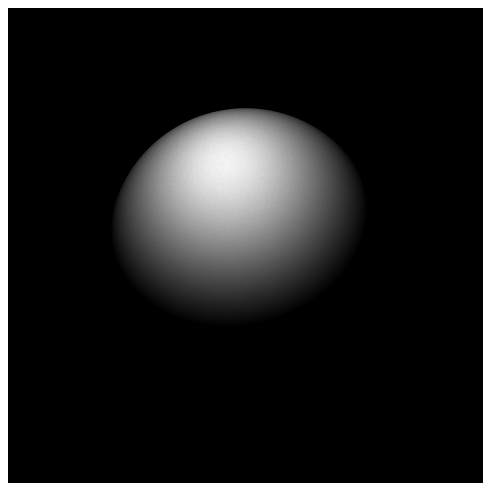

# Monte Carlo Ray Tracer

A high-performance Monte Carlo ray tracer that renders a sphere via backward ray tracing. The project progresses from a **serial C** baseline through **OpenMP** shared-memory parallelism to **CUDA** GPU acceleration and finally a **distributed multi-GPU** implementation using **MPI + CUDA** — achieving up to a **1200× speedup** over the serial version on four NVIDIA A100 GPUs.

<p align="center">
  
</p>

<p align="center"><em>1 billion rays, 1000 × 1000 grid, double precision — rendered on an NVIDIA A100</em></p>

---

## Table of Contents

- [Ray Tracing Algorithm](#ray-tracing-algorithm)
  - [Direction Sampling](#1-direction-sampling)
  - [Window Intersection](#2-window-intersection)
  - [Ray–Sphere Intersection](#3-raysphere-intersection)
  - [Lambertian Shading](#4-lambertian-shading)
- [Implementation Variants](#implementation-variants)
  - [Serial / OpenMP](#serial--openmp-ray_tracingc)
  - [Single-GPU CUDA](#single-gpu-cuda-ray_tracingcu)
  - [Multi-GPU MPI + CUDA](#multi-gpu-mpi--cuda-ray_tracing_mpicu)
- [Key Optimizations](#key-optimizations)
- [Performance Results](#performance-results)
- [Rendered Output](#rendered-output)
- [Build & Run](#build--run)
- [Project Structure](#project-structure)

---

## Ray Tracing Algorithm

The simulation uses **backward ray tracing**: rays originate at the observer (the origin) and are cast through a viewing window toward a sphere illuminated by a point light source. Each ray that hits the sphere contributes a brightness value to the corresponding pixel in an *n × n* grid.

### 1. Direction Sampling

A unit direction vector **V** is generated by uniformly sampling the unit sphere in spherical coordinates:

$$\phi \sim \mathcal{U}(0, \pi), \qquad \cos\theta \sim \mathcal{U}(-1, 1)$$

$$\vec{V} = \bigl(\sin\theta\,\cos\phi,\;\; \sin\theta\,\sin\phi,\;\; \cos\theta\bigr)$$

### 2. Window Intersection

The ray is projected from the origin onto a viewing window parallel to the *(x, z)*-plane at *y = W_y*:

$$\vec{W} = \frac{W_y}{V_y}\,\vec{V}$$

A ray is **rejected** if the projected point falls outside the window bounds: $|W_x| \geq W_{\max}$ or $|W_z| \geq W_{\max}$.

### 3. Ray–Sphere Intersection

For a sphere of radius *R* centered at **C**, the intersection point at distance *t* along the ray satisfies $|\vec{I} - \vec{C}|^2 = R^2$ with $\vec{I} = t\,\vec{V}$. Solving the quadratic:

$$t = (\vec{V} \cdot \vec{C}) - \sqrt{(\vec{V} \cdot \vec{C})^2 + R^2 - \vec{C}\cdot\vec{C}}$$

If the discriminant is negative, the ray misses the sphere and is rejected.

### 4. Lambertian Shading

At the intersection point **I**, the outward surface normal and the direction toward the light source **L** are:

$$\vec{N} = \frac{\vec{I} - \vec{C}}{|\vec{I} - \vec{C}|} \qquad,\qquad \vec{S} = \frac{\vec{L} - \vec{I}}{|\vec{L} - \vec{I}|}$$

The pixel brightness is the Lambertian term:

$$b = \max(0,\;\vec{S} \cdot \vec{N})$$

The value *b* is accumulated into the grid cell corresponding to the ray's window intersection.

---

## Implementation Variants

### Serial / OpenMP (`ray_tracing.c`)

The CPU implementation supports both serial and multi-threaded execution via **OpenMP**.  Each thread operates on its own copy of the output grid and a private [xoshiro256\*\*](https://prng.di.unimi.it/) PRNG instance, removing all contention during the main loop. Thread-local grids are reduced into the global grid after the parallel region.

### Single-GPU CUDA (`ray_tracing.cu`)

The CUDA implementation maps the ray-tracing loop onto the GPU using a **grid-stride loop** pattern.  Each CUDA thread processes *stride* rays, amortising the cost of `curand_init`.

- **Per-thread RNG** — `curandState` initialised with a unique sequence per thread.
- **Shared-memory reduction** — Per-thread sample counters are accumulated in shared memory; a single `atomicAdd` per block commits the total to global memory.
- **Unified rejection branch** — Window bounds and sphere intersection are tested in a single conditional to reduce warp divergence.
- **Precision toggle** — Compile with `-DUSE_FLOAT` to use FP32 (roughly 2× faster on most GPUs).

### Multi-GPU MPI + CUDA (`ray_tracing_mpi.cu`)

The distributed version partitions rays evenly across MPI ranks. Each rank:

1. Binds to a GPU via `cudaSetDevice(rank % device_count)`
2. Runs the same CUDA kernel on its share of rays
3. Participates in `MPI_Reduce` to sum per-rank grids on rank 0

Rank 0 writes the final result.

---

## Key Optimizations

| Optimization                        | Speedup Contribution |
| ----------------------------------- | -------------------- |
| Grid-stride loops                   | Amortises `curand_init` startup |
| Shared-memory counter reduction     | Reduces atomic contention by `blockDim` |
| Warp divergence minimization        | ~2× throughput gain by merging rejection branches |
| `rsqrt` for normalisation           | Faster than `1/sqrt` on GPU |
| FP32 precision mode                 | ~2× on V100/A100 (doubled FP32 throughput) |
| Occupancy-guided block/grid sizing  | ~20% gain over fixed 256-thread blocks |
| Host-side constant pre-computation  | Offloads billions of redundant FP ops |
| `__forceinline__` vector operations | Enables ILP across the pipeline |

---

## Performance Results

All benchmarks use **1 billion rays** on a **1000 × 1000** grid.

| Processor            | Precision | Total Time (s) | Kernel Time (s) | Speedup vs Serial | Random Samples      |
| -------------------- | --------- | -------------- | --------------- | ------------------ | ------------------- |
| CPU Serial (Xeon)    | FP64      | 343.02         | —               | 1×                 | 14,928,938,068      |
| CPU Serial (Xeon)    | FP32      | 345.81         | —               | 1×                 | 14,928,938,068      |
| CPU OpenMP × 48      | FP64      | 7.44           | —               | 46×                | 14,928,878,552      |
| CPU OpenMP × 48      | FP32      | 7.79           | —               | 44×                | 14,928,878,552      |
| NVIDIA V100          | FP64      | 0.85           | 0.72            | 404×               | 14,927,515,192      |
| NVIDIA V100          | FP32      | 0.43           | 0.31            | 798×               | 14,927,515,192      |
| NVIDIA A100          | FP64      | 0.52           | 0.42            | 660×               | 14,927,917,944      |
| NVIDIA A100          | FP32      | 0.34           | 0.18            | 1008×              | 14,927,917,944      |
| NVIDIA RTX 6000      | FP64      | 10.33          | 10.33           | 33×                | 14,928,558,522      |
| NVIDIA RTX 6000      | FP32      | 0.48           | 0.48            | 714×               | 14,928,558,522      |
| 4 × V100 (MPI)       | FP64      | 0.49           | 0.18            | 700×               | 14,928,161,560      |
| 4 × V100 (MPI)       | FP32      | 0.39           | 0.08            | 880×               | 14,928,161,560      |
| 4 × A100 (MPI)       | FP64      | 0.35           | 0.11            | 980×               | 14,928,161,560      |
| 4 × A100 (MPI)       | FP32      | 0.29           | 0.05            | 1182×              | 14,928,161,560      |

> **Peak speedup: ~1200×** when comparing the serial CPU execution against the 4×A100 MPI total time in FP32.

### Hardware

- **CPU:** Intel Xeon Gold 6248R @ 3.00 GHz, 48 cores (Cascade Lake, Midway3 cluster)
- **GPUs:** NVIDIA A100 (sm_80), V100 (sm_70), RTX 6000 (sm_75)

---

## Rendered Output

<p align="center">
  
  
  
</p>

<p align="center">
  <em>Left:</em> Serial &nbsp;|&nbsp; <em>Centre:</em> OpenMP (48 threads) &nbsp;|&nbsp; <em>Right:</em> Single V100
</p>

<p align="center">
  
  
  
</p>

<p align="center">
  <em>Left:</em> A100 (FP64) &nbsp;|&nbsp; <em>Centre:</em> A100 (FP32) &nbsp;|&nbsp; <em>Right:</em> 4×V100 MPI
</p>

---

## Build & Run

All targets use modular Makefiles that include a shared `common.mk`.

### Prerequisites

| Variant  | Requirements                        |
| -------- | ----------------------------------- |
| OpenMP   | GCC with `-fopenmp`                 |
| CUDA     | NVIDIA GPU, CUDA toolkit, `nvcc`    |
| MPI+CUDA | Above + Open MPI (`mpicc`, `mpirun`) |

### OpenMP (shared memory)

```bash
make -f Makefile.omp                            # double precision (default)
make -f Makefile.omp PRECISION=FLOAT            # single precision

./ray_tracing_omp <nrays> <ngrid> <threads>
# Example: ./ray_tracing_omp 1000000000 1000 12
```

### Single-GPU CUDA

```bash
make -f Makefile.cuda                           # V100, double precision
make -f Makefile.cuda GPU_TYPE=a100             # A100
make -f Makefile.cuda PRECISION=FLOAT           # single precision

./ray_tracing_cuda <nrays> <ngrid> <nblocks> <threads>
# Example: ./ray_tracing_cuda 1000000000 1000 640 640
```

### Multi-GPU MPI + CUDA

```bash
make -f Makefile.mpi
make -f Makefile.mpi GPU_TYPE=a100 PRECISION=FLOAT

mpirun -np <ranks> ./ray_tracing_mpi <nrays> <ngrid> <nblocks> <threads>
# Example: mpirun -np 4 ./ray_tracing_mpi 1000000000 1000 640 640
```

### Visualising Output

After a run, the binary grid is saved to `static/data/grid.dat`. Render it as an image:

```bash
cd static
python visualizer.py [prefix]
# Creates  ./images/[prefix]image.png
```

Requires `numpy`, `matplotlib`, and `pandas`.

### Cleaning Build Artifacts

```bash
make -f Makefile.omp clean
make -f Makefile.cuda clean
make -f Makefile.mpi clean
```

---

## Project Structure

```
.
├── common.mk                  # Shared Makefile variables and timer build rule
├── Makefile.omp                # OpenMP build
├── Makefile.cuda               # Single-GPU CUDA build
├── Makefile.mpi                # MPI + CUDA multi-GPU build
├── include/
│   ├── ray_tracing.h           # Project header
│   ├── rng.h                   # xoshiro256** PRNG (CPU)
│   └── timer.h                 # High-resolution timer (omp_get_wtime)
├── src/
│   ├── ray_tracing.c           # Serial / OpenMP version
│   ├── ray_tracing.cu          # Single-GPU CUDA version
│   ├── ray_tracing_mpi.cu      # MPI + CUDA distributed version
│   └── timer.c                 # Timer implementation
├── static/
│   ├── visualizer.py           # Binary grid → PNG renderer
│   ├── data/                   # Runtime output (grid.dat)
│   └── images/                 # Rendered sphere images
└── README.md
```